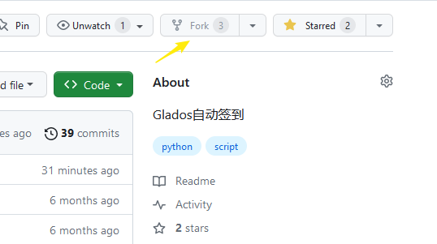
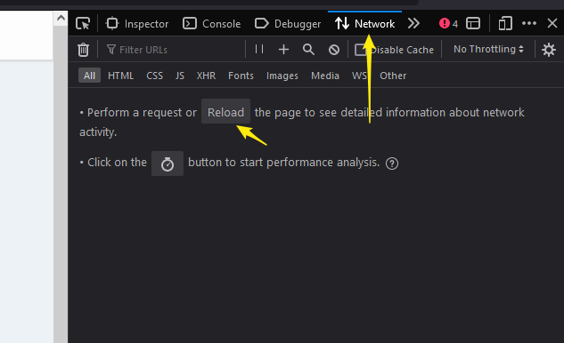
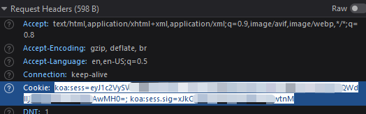
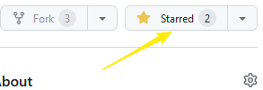

# Glados自动签到

## 食用方式：

### 注册一个GLaDOS的账号([注册地址](https://glados.space/landing/0A58E-NV28S-6U3QV-33VMG))

#### 我的邀请码：([0A58E-NV28S-6U3QV-33VMG](https://0a58e-nv28s-6u3qv-33vmg.glados.space)) 

### **Fork**本仓库



### 添加**secret**

1. 跳转至自己的仓库的`Settings`->`Secrets and variables`->`Action`

2. 添加1个`repository secret`，命名为`COOKIES`，其值对应GLaDOS账号的cookie值中的有效部分（获取方式如下）

- 在GLaDOS的签到页面按`F12`

- 切换到`Network`页面下，刷新



- 点击第一个选项卡后在`Request Headers`下找到`Cookie`，右键复制cookie的值即可

  > 参考格式：koa:sess=eyJ1c2xxxxxxxxxxxxxxxxxxxxxxxxxxxxxxxxxxxxxxxxxxAwMH0=; koa:sess.sig=xJkOxxxxxxxxxxxxxxxtnM;



- 多账号请在 `COOKIES` 中 添加多个 `cookies` 中间使用 `&`连接即可。（例如： `c1&c3&c3...`）

3. 手机推送（非必须）

- 添加1个`repository secret`，命名为`SENDKEY`，其值对应 PushDeer key: ([获取地址](https://www.pushdeer.com/product.html))。

### **star**自己的仓库



## 文件结构

```shell
│  checkin.py	# 签到脚本
│
├─.github
│  └─workflows
│          gladosCheck.yml	# Actions 配置文件
```

## 声明

本项目不保证稳定运行与更新, 因GitHub相关规定可能会删库, 请注意备份
